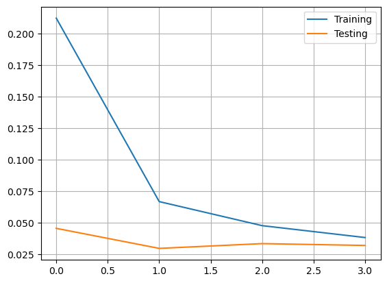

# Practical Work 04 – Deep Neural Networks
auhtors: Rachel Tranchida, Eva Ray

## Introduction
Dans ce laboratoire, nous allons en premier lieu explorer trois méthodes différentes pour classer des images de chiffres provenant du jeu de données MNIST : un MLP, un MLP à partir de l'histogramme des gradients (HOG) et un réseau neuronal convolutif (CNN). Dans une seconde partie, nous allons ensuite créer un autre CNN qui devra être capable de classifier des radios thoraciques entre "normal" et "pneumonie". Pour ce faire, nous allons travailler avec le framework `Keras`, qui est une bibliothèque d'outils liés aux réseaux de neuronea de haut niveau,  que nous avons déjà utilisé dans le laboratoire précédent. 

## Buts Pédagogiques
Les buts pédagogiques de ce laboratoire sont les suivants:
- Développer une meilleure compréhension de la différence entre `shallow` et `deep` neural networks.
- Comprendre les principes fondamentaux des réseaux de neurones convolutifs.
- Apprendre les bases du framework `Keras`.

## Partie 1

### Quel est l'algorithme d'apprentissage utilisé pour optimiser les poids du réseau de neurones?
L'algorithme utilisé pour optimisé les poids est `RMSprop`. RMSprop est un algorithme d'optimisation utilisé pour ajuster les poids d'un réseau de neurones. Il adapte les taux d'apprentissage des poids en utilisant une moyenne mobile des carrés des gradients précédents, ce qui permet une convergence plus rapide et une meilleure performance d'apprentissage.
<div style="text-align:center">
    
</div>

où:
- E[g] est la moyenne mobile des gradients au carré
- δc/δw est le gradient de la fonction de coût par rapport au poids
- η est le taux d'apprentissage
- β est le paramètre de la moyenne mobile

### Quels sont les paramètres (arguments) utilisés par cet algorithme?
Les paramètres de l'algorithme `RMSprop` peuvent être trouvés dans la documentation de `Keras` et sont les suivants:
```python
keras.optimizers.RMSprop(
    learning_rate=0.001,
    rho=0.9,
    momentum=0.0,
    epsilon=1e-07,
    centered=False,
    weight_decay=None,
    clipnorm=None,
    clipvalue=None,
    global_clipnorm=None,
    use_ema=False,
    ema_momentum=0.99,
    ema_overwrite_frequency=None,
    loss_scale_factor=None,
    gradient_accumulation_steps=None,
    name="rmsprop",
    **kwargs
)
```

### Quelle fonction de loss est utilisée?
La fonction de loss utilisée est `categorical_crossentropy`.
L'équation de la fonction de loss `categorical_crossentropy` est 
```
L = - ∑(y * log(y_pred))
```
où :
- L est la perte (loss) calculée pour un échantillon donné
- y représente les valeurs cibles réelles (sous forme d'un vecteur "one-hot")
- y_pred représente les probabilités prédites par le modèle pour chaque classe (également sous forme d'un vecteur).

## Partie 2
### Digit Recognition from Raw Data
Dans cet exercice, nous entraînons un réseaux de neurones en utilisant les données brutes des pixels de la base de données MNIST. Chaque chiffre de la base de données est une image de 28x28 pixels. Il y a 10 classes différentes, qui sont les chiffres de 0 à 9.
#### Modèle 1

##### Topologie du modèle

Vous trouvez ci-dessous les paramètres que nous avons choisi d'utiliser pour le premier modèle.

```python
model = Sequential()
model.add(Dense(512, input_shape=(784,), activation='sigmoid'))
#model.add(Dropout(0.5))
model.add(Dense(n_classes, activation='softmax'))
batch_size = 128
n_epoch = 10
```

Pour commencer, nous avons choisi d'ajouter des neurones dans la couche cachée en passant de 2 à 512, afin de donner une meilleure chance au modèle de capturer les motifs des données. Nous travaillons avec des images de chiffres, ce qui est une donnée relativement complexe donc un plus grand nombre de neurones a plus de chance de la comprendre. 

Nous avons aussi augmenté le nombre d'epochs en passant de 3 à 10. Cela permet au modèle de passer par plus d'itérations d'apprentissage, ce qui peut améliorer sa capacité à converger vers une solution optimale. Ce choix est pertinent lorsque le modèle est plus complexe, comme dans notre cas avec 512 neurones dans la couche cachée.

Nous avons choisi de ne pas ajouter de couche dopout pour l'instant car le modèle ne montre pas de signe d'overfitting avec les paramètres actuels.

##### Poids du modèle

Vous trouverez ci-dessous le résumé des poids et paramètres du modèle donné par la méthode `model.summary()` de `Keras`.

<pre style="white-space:pre;overflow-x:auto;line-height:normal;font-family:Menlo,'DejaVu Sans Mono',consolas,'Courier New',monospace">┏━━━━━━━━━━━━━━━━━━━━━━━━━━━━━━━━━┳━━━━━━━━━━━━━━━━━━━━━━━━┳━━━━━━━━━━━━━━━┓
┃<span style="font-weight: bold"> Layer (type)                    </span>┃<span style="font-weight: bold"> Output Shape           </span>┃<span style="font-weight: bold">       Param # </span>┃
┡━━━━━━━━━━━━━━━━━━━━━━━━━━━━━━━━━╇━━━━━━━━━━━━━━━━━━━━━━━━╇━━━━━━━━━━━━━━━┩
│ dense_4 (<span style="color: #0087ff; text-decoration-color: #0087ff">Dense</span>)                 │ (<span style="color: #00d7ff; text-decoration-color: #00d7ff">None</span>, <span style="color: #00af00; text-decoration-color: #00af00">512</span>)            │       <span style="color: #00af00; text-decoration-color: #00af00">401,920</span> │
├─────────────────────────────────┼────────────────────────┼───────────────┤
│ dense_5 (<span style="color: #0087ff; text-decoration-color: #0087ff">Dense</span>)                 │ (<span style="color: #00d7ff; text-decoration-color: #00d7ff">None</span>, <span style="color: #00af00; text-decoration-color: #00af00">10</span>)             │         <span style="color: #00af00; text-decoration-color: #00af00">5,130</span> │
└─────────────────────────────────┴────────────────────────┴───────────────┘
</pre>
<pre style="white-space:pre;overflow-x:auto;line-height:normal;font-family:Menlo,'DejaVu Sans Mono',consolas,'Courier New',monospace"><span style="font-weight: bold"> Total params: </span><span style="color: #00af00; text-decoration-color: #00af00">407,050</span> (1.55 MB)
</pre>
<pre style="white-space:pre;overflow-x:auto;line-height:normal;font-family:Menlo,'DejaVu Sans Mono',consolas,'Courier New',monospace"><span style="font-weight: bold"> Trainable params: </span><span style="color: #00af00; text-decoration-color: #00af00">407,050</span> (1.55 MB)
</pre>
<pre style="white-space:pre;overflow-x:auto;line-height:normal;font-family:Menlo,'DejaVu Sans Mono',consolas,'Courier New',monospace"><span style="font-weight: bold"> Non-trainable params: </span><span style="color: #00af00; text-decoration-color: #00af00">0</span> (0.00 B)
</pre>

Pour calculer ces poids manuellement, on peut procéder couche par couche.
- Pour la première couche: (784 * 512) + 512 = 401'920
- Pour la seconde couche (de sortie): (512 * 10) + 10 = 5'130

Pour avoir le nombre total de poids, on additionne le nombre de poids de toutes les couches, ce qui nous donne 407'050 poids.


##### Graphique de l'historique d'entraînement


##### Performances
Test score: 0.09036532044410706

Test accuracy: 0.972599983215332


##### Analyse

Nous constatons sur notre training history plot que le nombre d'epochs est bien choisi pour ces paramètres car, bien que la courbe de training pourrait encore baisser, plus d'epochs amèneraient à de l'overfitting.

Les performances du modèles sont très bonnes, avec une accuracy de 0.973. On peut supposer que le jeu de données est relativement facile à apprendre car c'est une très bonne accuracy pour seulement 10 epochs de training. On remarquera aussi que dans ce cas la mesure 'accuracy' est pertinente car le dataset est bien équilibré.

En regardant la matrice de confusions, on constate qu'il y a certaines classes que le modèle confond particulièrement. En particulier, le modèle a du mal à différencier les classes 7 et 2, 9 et 4, 3 et 5. Cela semble pouvoir s'expliquer car ces chiffres se ressemblent à l'écrit et ont des particularités communes, ce qui les rend plus difficiles à différenencier pour le modèle.

Nous allons essayer de corriger ces imprécisions dans le second modèle.


#### Modèle 2

##### Topologie du modèle

Vous trouvez ci-dessous les paramètres que nous avons choisi d'utiliser pour le second modèle.

```python
batch_size = 32
n_epoch = 20
model = Sequential()
model.add(Dense(512, input_shape=(784,), activation='sigmoid'))
model.add(Dropout(0.5))
model.add(Dense(n_classes, activation='softmax'))
```

Pour le second modèle, nous avons décidé d'ajouter une couche de dropout à 50%. En effet, nous avions constaté précedemment sur le training history plot que la courbe du training pouvait encore baisser mais que cela causerait de l'overfitting. Nous avons donc rajouté plus d'epochs en passant de 10 à 20 et nous espérons que la couche de dropout évitera l'overfitting. 

Nous avons aussi décidé de descendre la batch size de 128 à 32. Avec une plus petite taille de batch, chaque mise à jour du modèle est basée sur un sous-ensemble plus restreint des données d'entraînement. Cela peut aider à diversifier les exemples présentés au modèle à chaque itération, ce qui peut l'aider à généraliser mieux sur les données de validation et de test. Nous espérons donc que cela va aider le modèle à distinguer mieux certaines classes.

##### Poids du modèle

Vous trouverez ci-dessous le résumé des poids et paramètres du modèle donné par la méthode `model.summary()` de `Keras`.

<pre style="white-space:pre;overflow-x:auto;line-height:normal;font-family:Menlo,'DejaVu Sans Mono',consolas,'Courier New',monospace">┏━━━━━━━━━━━━━━━━━━━━━━━━━━━━━━━━━┳━━━━━━━━━━━━━━━━━━━━━━━━┳━━━━━━━━━━━━━━━┓
┃<span style="font-weight: bold"> Layer (type)                    </span>┃<span style="font-weight: bold"> Output Shape           </span>┃<span style="font-weight: bold">       Param # </span>┃
┡━━━━━━━━━━━━━━━━━━━━━━━━━━━━━━━━━╇━━━━━━━━━━━━━━━━━━━━━━━━╇━━━━━━━━━━━━━━━┩
│ dense_19 (<span style="color: #0087ff; text-decoration-color: #0087ff">Dense</span>)                │ (<span style="color: #00d7ff; text-decoration-color: #00d7ff">None</span>, <span style="color: #00af00; text-decoration-color: #00af00">512</span>)            │       <span style="color: #00af00; text-decoration-color: #00af00">401,920</span> │
├─────────────────────────────────┼────────────────────────┼───────────────┤
│ dropout_7 (<span style="color: #0087ff; text-decoration-color: #0087ff">Dropout</span>)             │ (<span style="color: #00d7ff; text-decoration-color: #00d7ff">None</span>, <span style="color: #00af00; text-decoration-color: #00af00">512</span>)            │             <span style="color: #00af00; text-decoration-color: #00af00">0</span> │
├─────────────────────────────────┼────────────────────────┼───────────────┤
│ dense_20 (<span style="color: #0087ff; text-decoration-color: #0087ff">Dense</span>)                │ (<span style="color: #00d7ff; text-decoration-color: #00d7ff">None</span>, <span style="color: #00af00; text-decoration-color: #00af00">10</span>)             │         <span style="color: #00af00; text-decoration-color: #00af00">5,130</span> │
└─────────────────────────────────┴────────────────────────┴───────────────┘
</pre>

<pre style="white-space:pre;overflow-x:auto;line-height:normal;font-family:Menlo,'DejaVu Sans Mono',consolas,'Courier New',monospace"><span style="font-weight: bold"> Total params: </span><span style="color: #00af00; text-decoration-color: #00af00">407,050</span> (1.55 MB)
</pre>
<pre style="white-space:pre;overflow-x:auto;line-height:normal;font-family:Menlo,'DejaVu Sans Mono',consolas,'Courier New',monospace"><span style="font-weight: bold"> Trainable params: </span><span style="color: #00af00; text-decoration-color: #00af00">407,050</span> (1.55 MB)
</pre>
<pre style="white-space:pre;overflow-x:auto;line-height:normal;font-family:Menlo,'DejaVu Sans Mono',consolas,'Courier New',monospace"><span style="font-weight: bold"> Non-trainable params: </span><span style="color: #00af00; text-decoration-color: #00af00">0</span> (0.00 B)
</pre>

Pour calculer ces poids manuellement, on peut procéder couche par couche.
- Pour la première couche: (784 * 512) + 512 = 401'920
- La couche dropout ne possède pas de paramètres à entraîner.
- Pour la seconde couche (de sortie): (512 * 10) + 10 = 5'130

Pour avoir le nombre total de poids, on additionne le nombre de poids de toutes les couches, ce qui nous done 407'050 poids.

##### Graphique de l'Historique d'Entraînement


##### Performances

Test score: 0.07116231322288513

Test accuracy: 0.9797999858856201


##### Analyse 

Le training plot history est plutôt satisfaisant. Il aurait peut être fallu arrêter l'entraînement quelques epochs plus tôt car le modèle commence gentiment à overfitter. Le loss est plus bas que dans le modèle précédent, ce qui était notre but. On voit encore une fois que la courbe de training continue à descendre mais que dans notre cas continuer l'entraîenement plus longtemps causerait de l'overfitting.

L'accuracy est d'environ 0.98. Ce chiffre est légèrement mieux que précédemment et est très bon en général. On notera que quand les accuracy sont aussi hautes, il devient difficile de continuer à les améliorer. 

Lorsqu'on regarde la matrice de confusion, on constate que le modèle a toujours du mal à différencier les classes 7 et 2, 9 et 4, 3 et 5 mais qu'il y a un petit peu moins de faux négatifs qu'avant. En particulier, le second modèle semble mieux différencier les classes 3 et 5 que le premier modèle.

#### Modèle 3

##### Topologie du modèle

Vous trouvez ci-dessous les paramètres que nous avons choisi d'utiliser pour le troisième modèle.

```python
batch_size = 128
n_epoch = 30
model = Sequential()
model.add(Dense(512, input_shape=(784,), activation='sigmoid'))
model.add(Dropout(0.5))
model.add(Dense(256, activation="relu"))
model.add(Dropout(0.5))
model.add(Dense(n_classes, activation='softmax'))
```

Pour le modèle final, nous avons décidé de remettre une batch size de 128 car nous n'avions pas été spécialement s des bénéfices d'une batch size de 32. 

Nous avons décidé de rajouter une couche cachée de 256 neurones et de fonction d'activation `relu`, suivie d'une nouvelle couche de dropout à 50%. Nous espérons que rajouter une couche aide le modèle à apprendre la complexité des images plus en détails et à différencier les classes problématiques. 

Comme nous avons vu dans le training plot history précédent, la courbe de training continuait de descendre. Nous avons donc rajouté des epochs et nous passons de 20 à 30 epochs. Les couches de dropout devraient éviter d'avoir trop d'overfitting.

##### Poids du modèle

Vous trouverez ci-dessous le résumé des poids et paramètres du modèle donné par la méthode `model.summary()` de `Keras`.

<pre style="white-space:pre;overflow-x:auto;line-height:normal;font-family:Menlo,'DejaVu Sans Mono',consolas,'Courier New',monospace">┏━━━━━━━━━━━━━━━━━━━━━━━━━━━━━━━━━┳━━━━━━━━━━━━━━━━━━━━━━━━┳━━━━━━━━━━━━━━━┓
┃<span style="font-weight: bold"> Layer (type)                    </span>┃<span style="font-weight: bold"> Output Shape           </span>┃<span style="font-weight: bold">       Param # </span>┃
┡━━━━━━━━━━━━━━━━━━━━━━━━━━━━━━━━━╇━━━━━━━━━━━━━━━━━━━━━━━━╇━━━━━━━━━━━━━━━┩
│ dense_21 (<span style="color: #0087ff; text-decoration-color: #0087ff">Dense</span>)                │ (<span style="color: #00d7ff; text-decoration-color: #00d7ff">None</span>, <span style="color: #00af00; text-decoration-color: #00af00">512</span>)            │       <span style="color: #00af00; text-decoration-color: #00af00">401,920</span> │
├─────────────────────────────────┼────────────────────────┼───────────────┤
│ dropout_8 (<span style="color: #0087ff; text-decoration-color: #0087ff">Dropout</span>)             │ (<span style="color: #00d7ff; text-decoration-color: #00d7ff">None</span>, <span style="color: #00af00; text-decoration-color: #00af00">512</span>)            │             <span style="color: #00af00; text-decoration-color: #00af00">0</span> │
├─────────────────────────────────┼────────────────────────┼───────────────┤
│ dense_22 (<span style="color: #0087ff; text-decoration-color: #0087ff">Dense</span>)                │ (<span style="color: #00d7ff; text-decoration-color: #00d7ff">None</span>, <span style="color: #00af00; text-decoration-color: #00af00">256</span>)            │       <span style="color: #00af00; text-decoration-color: #00af00">131,328</span> │
├─────────────────────────────────┼────────────────────────┼───────────────┤
│ dropout_9 (<span style="color: #0087ff; text-decoration-color: #0087ff">Dropout</span>)             │ (<span style="color: #00d7ff; text-decoration-color: #00d7ff">None</span>, <span style="color: #00af00; text-decoration-color: #00af00">256</span>)            │             <span style="color: #00af00; text-decoration-color: #00af00">0</span> │
├─────────────────────────────────┼────────────────────────┼───────────────┤
│ dense_23 (<span style="color: #0087ff; text-decoration-color: #0087ff">Dense</span>)                │ (<span style="color: #00d7ff; text-decoration-color: #00d7ff">None</span>, <span style="color: #00af00; text-decoration-color: #00af00">10</span>)             │         <span style="color: #00af00; text-decoration-color: #00af00">2,570</span> │
└─────────────────────────────────┴────────────────────────┴───────────────┘
</pre>
<pre style="white-space:pre;overflow-x:auto;line-height:normal;font-family:Menlo,'DejaVu Sans Mono',consolas,'Courier New',monospace"><span style="font-weight: bold"> Total params: </span><span style="color: #00af00; text-decoration-color: #00af00">535,818</span> (2.04 MB)
</pre>
<pre style="white-space:pre;overflow-x:auto;line-height:normal;font-family:Menlo,'DejaVu Sans Mono',consolas,'Courier New',monospace"><span style="font-weight: bold"> Trainable params: </span><span style="color: #00af00; text-decoration-color: #00af00">535,818</span> (2.04 MB)
</pre>
<pre style="white-space:pre;overflow-x:auto;line-height:normal;font-family:Menlo,'DejaVu Sans Mono',consolas,'Courier New',monospace"><span style="font-weight: bold"> Non-trainable params: </span><span style="color: #00af00; text-decoration-color: #00af00">0</span> (0.00 B)
</pre>

Pour calculer ces poids manuellement, on peut procéder couche par couche.
- Pour la première couche: (784 * 512) + 512 = 401'920
- La première couche de dropout ne possède pas de paramètres à entraîner.
- Pour la seconde couche: (512 * 256) + 256 = 131'328
- La seconde couche de dropout ne possède pas de paramètres à entraîner.
- Pour la troisième couche (de sortie): (256 * 10) + 10 = 2'570

Pour avoir le nombre total de poids, on additionne le nombre de poids de toutes les couches, ce qui nous done 535'818 poids.

##### Graphique de l'historique d'entraînement


##### Performances

Test score: 0.07027491182088852

Test accuracy: 0.9817000031471252


##### Analyse

Le training history plot est très satisfaisant. Il n'y a pas d'overfitting avec 30 epochs pour ces paramètres. La courbe de training est très légèrement encore en train de descendre mais bien moins qu'avant. 

L'accuracy est de 0.982, ce qui est la meilleure accuracy que nous avons eue jusqu'à présent. C'est une très bonne accuracy.

On constate dans la matrice de confusion que le modèle a toujours du mal avec les classes 4 et 9. Il fait aussi encore des erreurs d'identification entre les classes 2 et 7, 3 et 5 mais nettement moins qu'avec les autres modèles. Il serait bien sûr toujours possible d'améliorer ce modèle.

Ce dernier modèle est le modèle sélectionné pour la première expérience.

### Digit recognition from features of the input data
Dans cet exercice, nous entraînons un réseaux de neurones en utilisant les données brutes des pixels de la base de données MNIST. Cette fois, au lieu d'utiliser les images de 28x28 pixels comme inputs, nous calculons 
les caractéristiques de l'histogramme des gradients (HOG) de parties de l'image et utilisons ces caractéristiques comme inputs pour le réseau de neurones.

#### Modèle 1

##### Topologie du Modèle

Vous trouvez ci-dessous les paramètres que nous avons choisi d'utiliser pour le premier modèle.

```python
batch_size = 128
n_epoch = 50
model = Sequential()
model.add(Dense(64, input_shape=(hog_size,), activation='relu'))
model.add(Dropout(0.5))
model.add(Dense(n_classes, activation='softmax'))
```

Pour commencer, nous avons choisi d'augmenter le nombre de neurones dans la couche cachée en passant de 2 à 64, afin de donner une chance au modèle de mieux appréhender les données. 

Nous avons aussi augmenté le nombre d'epochs de 3 à 50 et avons donc aussi ajouté une couche de dropout pour minimiser l'overfitting.

##### Poids du modèle

Vous trouverez ci-dessous le résumé des poids et paramètres du modèle donné par la méthode `model.summary()` de `Keras`.

<pre style="white-space:pre;overflow-x:auto;line-height:normal;font-family:Menlo,'DejaVu Sans Mono',consolas,'Courier New',monospace">┏━━━━━━━━━━━━━━━━━━━━━━━━━━━━━━━━━┳━━━━━━━━━━━━━━━━━━━━━━━━┳━━━━━━━━━━━━━━━┓
┃<span style="font-weight: bold"> Layer (type)                    </span>┃<span style="font-weight: bold"> Output Shape           </span>┃<span style="font-weight: bold">       Param # </span>┃
┡━━━━━━━━━━━━━━━━━━━━━━━━━━━━━━━━━╇━━━━━━━━━━━━━━━━━━━━━━━━╇━━━━━━━━━━━━━━━┩
│ dense_4 (<span style="color: #0087ff; text-decoration-color: #0087ff">Dense</span>)                 │ (<span style="color: #00d7ff; text-decoration-color: #00d7ff">None</span>, <span style="color: #00af00; text-decoration-color: #00af00">64</span>)             │        <span style="color: #00af00; text-decoration-color: #00af00">25,152</span> │
├─────────────────────────────────┼────────────────────────┼───────────────┤
│ dropout (<span style="color: #0087ff; text-decoration-color: #0087ff">Dropout</span>)               │ (<span style="color: #00d7ff; text-decoration-color: #00d7ff">None</span>, <span style="color: #00af00; text-decoration-color: #00af00">64</span>)             │             <span style="color: #00af00; text-decoration-color: #00af00">0</span> │
├─────────────────────────────────┼────────────────────────┼───────────────┤
│ dense_5 (<span style="color: #0087ff; text-decoration-color: #0087ff">Dense</span>)                 │ (<span style="color: #00d7ff; text-decoration-color: #00d7ff">None</span>, <span style="color: #00af00; text-decoration-color: #00af00">10</span>)             │           <span style="color: #00af00; text-decoration-color: #00af00">650</span> │
└─────────────────────────────────┴────────────────────────┴───────────────┘
</pre>
<pre style="white-space:pre;overflow-x:auto;line-height:normal;font-family:Menlo,'DejaVu Sans Mono',consolas,'Courier New',monospace"><span style="font-weight: bold"> Total params: </span><span style="color: #00af00; text-decoration-color: #00af00">25,802</span> (100.79 KB)
</pre>
<pre style="white-space:pre;overflow-x:auto;line-height:normal;font-family:Menlo,'DejaVu Sans Mono',consolas,'Courier New',monospace"><span style="font-weight: bold"> Trainable params: </span><span style="color: #00af00; text-decoration-color: #00af00">25,802</span> (100.79 KB)
</pre>
<pre style="white-space:pre;overflow-x:auto;line-height:normal;font-family:Menlo,'DejaVu Sans Mono',consolas,'Courier New',monospace"><span style="font-weight: bold"> Non-trainable params: </span><span style="color: #00af00; text-decoration-color: #00af00">0</span> (0.00 B)
</pre>

Pour calculer ces poids manuellement, on peut procéder couche par couche.
- Pour la première couche: (392 * 64) + 64 = 25'152, où hog_size = 392
- La première couche de dropout ne possède pas de paramètres à entraîner.
- Pour la seconde couche: (640 * 10) + 10 = 650

Pour avoir le nombre total de poids, on additionne le nombre de poids de toutes les couches, ce qui nous done 25'802 poids.

##### Graphique de l'historique d'entraînement


##### Performances

Test score: 0.09391739219427109

Test accuracy: 0.9775999784469604


##### Analyse

Nous constatons que le training history plot est plutôt correct. Il n'y a pas d'overfitting. On constate que la courbe de training a peu baissé pendant les 10 à 20 dernières époques donc nous aurions pu potentiellement arrêter le training plus tôt. 

L'accuracy est d'environ 0.978, ce qui est très bon. En regardant la matrice de confusion, on constate que le modèle a, comme pour la première expérience, du mal à distinguer certaines classes. En particulier, le modèle confond souvent les classes 5 et 3, 4 et 9, comme dans la première expérience mais aussi 7 et 9, 3 et 8 qui ne posaient pas particulièrement de problèmes lors de la première expérience. Les descripteurs HOG sont conçus pour être invariants à certaines transformations telles que la translation, l'échelle et la rotation. Cela peut rendre le modèle moins sensible à ces variations dans les données d'entrée, ce qui pourrait contribuer à une différence de classification pour certaines classes, en comparaison avec la première expérience.

On remarque aussi qu'en utilisant le HOG, le modèle n'a pas de mal à distinguer les classes 2 et 7 qui posaient problème en utilisant les images brutes. Il est possible que les caractéristiques extraites par le HOG aient permis au modèle de mieux distinguer ces deux classes. 

#### Modèle 2

##### Topologie du Modèle

Vous trouvez ci-dessous les paramètres que nous avons choisi d'utiliser pour le second modèle.

```python
batch_size = 128
n_epoch = 20
model = Sequential()
model.add(Dense(64, input_shape=(hog_size,), activation='relu'))
model.add(Dropout(0.5))
model.add(Dense(n_classes, activation='softmax'))

n_orientations = 16
pix_p_cell = 4
hog_size = int(height * width * n_orientations / (pix_p_cell * pix_p_cell)) // =784
```

Par rapport au premier modèle, nous avons réduit le nombre d'epoques, vu que la courbe de training du traininh history plot du premier modèle semblait stagner sur les dernières époques.

Nous avons aussi changé le nombre d'orientations en passant de 8 à 16, dans l'espoir que cela permette au HOG de capturer plus de détails dans les contours de l'image et que le modèle ait moins de mal à distinguer les classes problématiques.

##### Poids du modèle

Vous trouverez ci-dessous le résumé des poids et paramètres du modèle donné par la méthode `model.summary()` de `Keras`.

<pre style="white-space:pre;overflow-x:auto;line-height:normal;font-family:Menlo,'DejaVu Sans Mono',consolas,'Courier New',monospace">┏━━━━━━━━━━━━━━━━━━━━━━━━━━━━━━━━━┳━━━━━━━━━━━━━━━━━━━━━━━━┳━━━━━━━━━━━━━━━┓
┃<span style="font-weight: bold"> Layer (type)                    </span>┃<span style="font-weight: bold"> Output Shape           </span>┃<span style="font-weight: bold">       Param # </span>┃
┡━━━━━━━━━━━━━━━━━━━━━━━━━━━━━━━━━╇━━━━━━━━━━━━━━━━━━━━━━━━╇━━━━━━━━━━━━━━━┩
│ dense_18 (<span style="color: #0087ff; text-decoration-color: #0087ff">Dense</span>)                │ (<span style="color: #00d7ff; text-decoration-color: #00d7ff">None</span>, <span style="color: #00af00; text-decoration-color: #00af00">64</span>)             │        <span style="color: #00af00; text-decoration-color: #00af00">50,240</span> │
├─────────────────────────────────┼────────────────────────┼───────────────┤
│ dropout_7 (<span style="color: #0087ff; text-decoration-color: #0087ff">Dropout</span>)             │ (<span style="color: #00d7ff; text-decoration-color: #00d7ff">None</span>, <span style="color: #00af00; text-decoration-color: #00af00">64</span>)             │             <span style="color: #00af00; text-decoration-color: #00af00">0</span> │
├─────────────────────────────────┼────────────────────────┼───────────────┤
│ dense_19 (<span style="color: #0087ff; text-decoration-color: #0087ff">Dense</span>)                │ (<span style="color: #00d7ff; text-decoration-color: #00d7ff">None</span>, <span style="color: #00af00; text-decoration-color: #00af00">10</span>)             │           <span style="color: #00af00; text-decoration-color: #00af00">650</span> │
└─────────────────────────────────┴────────────────────────┴───────────────┘
</pre>
<pre style="white-space:pre;overflow-x:auto;line-height:normal;font-family:Menlo,'DejaVu Sans Mono',consolas,'Courier New',monospace"><span style="font-weight: bold"> Total params: </span><span style="color: #00af00; text-decoration-color: #00af00">50,890</span> (198.79 KB)
</pre>
<pre style="white-space:pre;overflow-x:auto;line-height:normal;font-family:Menlo,'DejaVu Sans Mono',consolas,'Courier New',monospace"><span style="font-weight: bold"> Trainable params: </span><span style="color: #00af00; text-decoration-color: #00af00">50,890</span> (198.79 KB)
</pre>
<pre style="white-space:pre;overflow-x:auto;line-height:normal;font-family:Menlo,'DejaVu Sans Mono',consolas,'Courier New',monospace"><span style="font-weight: bold"> Non-trainable params: </span><span style="color: #00af00; text-decoration-color: #00af00">0</span> (0.00 B)
</pre>

Pour calculer ces poids manuellement, on peut procéder couche par couche.
- Pour la première couche: (784 * 64) + 64 = 50'240, où hog_size = 784
- La première couche de dropout ne possède pas de paramètres à entraîner.
- Pour la seconde couche: (640 * 10) + 10 = 650

Pour avoir le nombre total de poids, on additionne le nombre de poids de toutes les couches, ce qui nous done 50'890 poids.

##### Graphique de l'historique d'entraînement


##### Performances
Test score: 0.07377872616052628

Test accuracy: 0.9793999791145325


##### Analyse

Le training history plot est satisfaisant. Le trianing s'arrête avant d'overfitter et la courbe de training semble commencer à stagner donc ajouter des époques ne semble pas nécessaire.

L'accuracy est d'environ 0.979, ce qui est très bien. Cependant, cette accuracy est quasiment identique à celle du premier modèle, ce qui implique qu'ajouter des orientations au HOG n'a potentiellement pas beaucoup aidé le modèle à différencier les classes problématiques. 

Lorsqu'on regarde la matrice de confusion, on constate que ce sont les mêmes classe qui sont difficiles à distinguer que pour le premier modèle mais que le nombre de faux négatif est un tout petit peu plus bas.

#### Modèle 3

##### Topologie du Modèle

Vous trouvez ci-dessous les paramètres que nous avons choisi d'utiliser pour le troisième modèle.

```python
batch_size = 256
n_epoch = 10
n_orientations = 16
pix_p_cell = 4
hog_size = int(height * width * n_orientations / (pix_p_cell * pix_p_cell))
model = Sequential()
model.add(Dense(128, input_shape=(hog_size,), activation='relu'))
model.add(Dropout(0.5))
model.add(Dense(n_classes, activation='softmax'))
```

Nous avons ajouté des neurones dans la couche cachée en passant de 64 à 128 pour donner une meilleure chance au modèle de comprendre la complexité des données. Nous avons aussi augmenté la batch size de 128 à 256 pour la même raison.

En contrepartie, nous avons baissé le nombre d'epochs de 20 à 10 pour minimiser l'overfitting.

##### Poids du Modèle

Vous trouverez ci-dessous le résumé des poids et paramètres du modèle donné par la méthode `model.summary()` de `Keras`.

_________________________________________________________________
 Layer (type)                Output Shape              Param #   
=================================================================
 dense_19 (Dense)            (None, 128)               100480    
                                                                 
 dropout_9 (Dropout)         (None, 128)               0         
                                                                 
 dense_20 (Dense)            (None, 10)                1290      
                                                                 
=================================================================
Total params: 101,770
Trainable params: 101,770
Non-trainable params: 0
_________________________________________________________________

Pour calculer ces poids manuellement, on peut procéder couche par couche.
- Pour la première couche: (784 * 128) + 128 = 100'480, où hog_size = 784
- La première couche de dropout ne possède pas de paramètres à entraîner.
- Pour la seconde couche: (128 * 10) + 10 = 1290

Pour avoir le nombre total de poids, on additionne le nombre de poids de toutes les couches, ce qui nous done 101'770 poids.

##### Graphique de l'historique d'entraînement


##### Performances

Test score: 0.061707451939582825

Test accuracy: 0.9807999730110168


##### Analyse

En regardant le le training history plot, nous constatons que l'entraînement s'est arrêté à temps pour qu'il n'y ait pas d'overfitting. La courbe de training est encore légèrement en train de descendre et aurait pu bénéficier de quelques epochs d'entraînement en plus.

L'accuracy est de 0.981, ce qui est une très bonne accuracy et la meilleure que nous avons eue pour la seconde expérience. Ceci dit, cette accuracy, bien que meilleure, reste très proche de celle des autres modèles.

Lorsqu'on regarde la matrice de confusion, on constate que le modèle semble un peu meilleure que le précédent pour distinguer les classes problématiques. En effet, les nombres de faux négatifs sont un peu plus bas. Ceci dit, les classes qui sont le plus difficiles à distinguer restent 3 et 8, 3 et 5, 4 et 9, 7 et 9.

Ce modèle est le meilleur que nous avons créé pour la deuxième expérience, c'est donc celui-ci que nous sélectionnons. 

### Convolutional neural network digit recognition

Dans cet exercice, nous allons entraîner un réseau de neurones convolutif capable de déterminer automatiquement les features pertinentes pour reconnaître les chiffre de 0 à 9.

#### Modèle 1

##### Topologie du Modèle

Vous trouvez ci-dessous les paramètres que nous avons choisi d'utiliser pour le premier modèle.

```python
batch_size = 128
n_epoch = 3
l0 = Input(shape=(height, width, 1), name='l0')

l1 = Conv2D(32, (2, 2), padding='same', activation='relu', name='l1')(l0)
l1_mp = MaxPooling2D(pool_size=(2, 2), name='l1_mp')(l1)

l2 = Conv2D(32, (2, 2), padding='same', activation='relu', name='l2')(l1)
l2_mp = MaxPooling2D(pool_size=(2, 2), name='l2_mp')(l2)

l3 = Conv2D(32, (2, 2), padding='same', activation='relu', name='l3')(l2)
l3_mp = MaxPooling2D(pool_size=(2, 2), name='l3_mp')(l3)

flat = Flatten(name='flat')(l3_mp)

l4 = Dense(64, activation='relu', name='l4')(flat)
l5 = Dense(n_classes, activation='softmax', name='l5')(l4)

model = Model(inputs=l0, outputs=l5)
```

Pour ce premier modèle, nous avons décidé d'augmenter le nombre de filtres de 2 à 32 et le nombre de neurones dans la couche cachée de 2 à 64 pour extraire les caractérsitiques plus complexes des données.

##### Poids du Modèle

Vous trouverez ci-dessous le résumé des poids et paramètres du modèle donné par la méthode `model.summary()` de `Keras`.

Model: "model_1"
_________________________________________________________________
 Layer (type)                Output Shape              Param #   
=================================================================
 l0 (InputLayer)             [(None, 28, 28, 1)]       0         
                                                                 
 l1 (Conv2D)                 (None, 28, 28, 32)        160       
                                                                 
 l2 (Conv2D)                 (None, 28, 28, 32)        4128      
                                                                 
 l3 (Conv2D)                 (None, 28, 28, 32)        4128      
                                                                 
 l3_mp (MaxPooling2D)        (None, 14, 14, 32)        0         
                                                                 
 flat (Flatten)              (None, 6272)              0         
                                                                 
 l4 (Dense)                  (None, 64)                401472    
                                                                 
 l5 (Dense)                  (None, 10)                650       
                                                                 
=================================================================
Total params: 410,538
Trainable params: 410,538
Non-trainable params: 0
_________________________________________________________________

Pour calculer ces poids manuellement, on peut procéder couche par couche.

- Couche de convolution l1 :
    - Nombre de filtres : 32
    - Taille des filtres : (2, 2)
    - Profondeur des filtres (canaux d'entrée) : 1 (images en niveaux de gris)
    - Nombre de poids par filtre : (2 * 2 * 1) + 1 (biais) = 5
    - Nombre total de poids : 32 * 5 = 160

- Couche de convolution l2 :
    - Nombre de filtres : 32
    - Taille des filtres : (2, 2)
    - Profondeur des filtres (canaux d'entrée) : 32 (sortie de la couche l1)
    - Nombre de poids par filtre : (2 * 2 * 32) + 1 (biais) = 129
    - Nombre total de poids : 32 * 129 = 4128

- Couche de convolution l3 :
    - Nombre de filtres : 32
    - Taille des filtres : (2, 2)
    - Profondeur des filtres (canaux d'entrée) : 32 (sortie de la couche l2)
    - Nombre de poids par filtre : (2 * 2 * 32) + 1 (biais) = 129
    - Nombre total de poids : 32 * 129 = 4128

- Couche dense l4 :
    - Nombre de neurones : 64
    - Taille de l'entrée aplatie : 14 * 14 * 32 = 6272 
    - Nombre de poids : (6272 * 64) + 64 (biais) = 401'472

- Couche dense l5 :
    - Nombre de neurones : 10 (nombre de classes dans le problème de classification)
    - Taille de l'entrée : 64 (sortie de la couche l4)
    - Nombre de poids : (64 * 10) + 10 (biais) = 650


Pour avoir le nombre total de poids, on additionne le nombre de poids de toutes les couches, ce qui nous done 410'538 poids.

##### Graphique de l'historique d'entraînement


##### Performances

Test score: 0.04008874669671059

Test accuracy: 0.9872000217437744


##### Analyse

Le training history plot est assez bon. On constate que le modèle commence légèrement à overfitter. Le courbe de training est encore en train de descendre mais continuer l'entraînement aurait agravé l'overfitting. 

L'accuracy est de 0.987, ce qui est excellent. On constate dès le premier modèle qu'un CNN semble mieux appréhender les détails du jeu de données car cette accuracy est meilleure que celles des modèles sélectionnés pour la première et la seconde expérience.

Lorsqu'on observe la matrice de confusion, on constate que le modèle semble avoir du mal à différencier les classes 2 et 7, qui posaient déjà problème dans la première expérience. Il y aussi un nombre relativement élévé de faux négatifs pour les classes 8 et 2. Aucun autre couple de classe ne semble être spécialement difficile à départager pour le modèle. Cette observation diffère des expériences précédentes. En effet, le modèle semble moins confondre des classes en particulier que ceux des expériences précédentes. Cela vient probablement du fait que le CNN choisit lui-même les features d'intérêt pour départager les classes et qu'il est très bon dans cette tâche!

#### Modèle 2

##### Topologie du Modèle

Vous trouvez ci-dessous les paramètres que nous avons choisi d'utiliser pour le second modèle.

```python
batch_size = 128
n_epoch = 5
l0 = Input(shape=(height, width, 1), name='l0')

l1 = Conv2D(32, (2, 2), padding='same', activation='relu', name='l1')(l0)
l1_mp = MaxPooling2D(pool_size=(2, 2), name='l1_mp')(l1)

l2 = Conv2D(32, (2, 2), padding='same', activation='relu', name='l2')(l1)
l2_mp = MaxPooling2D(pool_size=(2, 2), name='l2_mp')(l2)

l3 = Conv2D(32, (2, 2), padding='same', activation='relu', name='l3')(l2)
l3_mp = MaxPooling2D(pool_size=(2, 2), name='l3_mp')(l3)

flat = Flatten(name='flat')(l3_mp)

l4 = Dense(128, activation='relu', name='l4')(flat)
l4_drop = Dropout(0.5)(l4)

l5 = Dense(n_classes, activation='softmax', name='l5')(l4_drop)

model = Model(inputs=l0, outputs=l5)
```

Dans ce second modèle, nous avons augmenté le nombre de neurones de la couche cachée de 64 à 128 pour que le modèle puisse mieux apprendre les complexités du jeu de données. Nous avons aussi ajouté une couche de dopout à 0.5 pour minimiser l'overfitting. Finalement, nous avons entraîné le modèle pendant 5 epochs, puisque dans la training history plot précédent, la courbe du training semblait pouvoir encore descendre. 

##### Poids du Modèle

Vous trouverez ci-dessous le résumé des poids et paramètres du modèle donné par la méthode `model.summary()` de `Keras`.

Model: "model_10"
_________________________________________________________________
 Layer (type)                Output Shape              Param #   
=================================================================
 l0 (InputLayer)             [(None, 28, 28, 1)]       0         
                                                                 
 l1 (Conv2D)                 (None, 28, 28, 32)        160       
                                                                 
 l2 (Conv2D)                 (None, 28, 28, 32)        4128      
                                                                 
 l3 (Conv2D)                 (None, 28, 28, 32)        4128      
                                                                 
 l3_mp (MaxPooling2D)        (None, 14, 14, 32)        0         
                                                                 
 flat (Flatten)              (None, 6272)              0         
                                                                 
 l4 (Dense)                  (None, 128)               802944    
                                                                 
 dropout_7 (Dropout)         (None, 128)               0         
                                                                 
 l5 (Dense)                  (None, 10)                1290      
                                                                 
=================================================================
Total params: 812,650
Trainable params: 812,650
Non-trainable params: 0
_________________________________________________________________

Pour calculer ces poids manuellement, on peut procéder couche par couche.

- Couche de convolution l1 :
    - Nombre de filtres : 32
    - Taille des filtres : (2, 2)
    - Profondeur des filtres (canaux d'entrée) : 1 (images en niveaux de gris)
    - Nombre de poids par filtre : (2 * 2 * 1) + 1 (biais) = 5
    - Nombre total de poids : 32 * 5 = 160

- Couche de convolution l2 :
    - Nombre de filtres : 32
    - Taille des filtres : (2, 2)
    - Profondeur des filtres (canaux d'entrée) : 32 (sortie de la couche l1)
    - Nombre de poids par filtre : (2 * 2 * 32) + 1 (biais) = 129
    - Nombre total de poids : 32 * 129 = 4128

- Couche de convolution l3 :
    - Nombre de filtres : 32
    - Taille des filtres : (2, 2)
    - Profondeur des filtres (canaux d'entrée) : 32 (sortie de la couche l2)
    - Nombre de poids par filtre : (2 * 2 * 32) + 1 (biais) = 129
    - Nombre total de poids : 32 * 129 = 4128

- Couche dense l4 :
    - Nombre de neurones : 128
    - Taille de l'entrée aplatie : 14x14x32 = 6272
    - Nombre de poids : (6272 * 128) + 128 (biais) = 802'944

- Couche Dropout l4_drop :
    - Cette couche ne possède pas de paramètres à entraîner.

- Couche dense l5 :
    - Nombre de neurones : 10 (nombre de classes dans le problème de classification)
    - Taille de l'entrée : 128 (sortie de la couche l4_drop)
    - Nombre de poids : (128 * 10) + 10 (biais) = 1290


Pour avoir le nombre total de poids, on additionne le nombre de poids de toutes les couches, ce qui nous done 812'650 poids.

##### Graphique de l'historique d'entraînement


##### Performances

Test score: 0.0349692776799202

Test accuracy: 0.988099992275238


##### Analyse

Le training history plot est très satisfaisant. Il n'y a pas d'overfitting et la courbe de training commence à se stabiliser donc l'entraînement n'aurait pas eu besoin de durer plus longtemps.

L'accuracy est de 0.988, ce qui est excellent. C'est très légèrement au-dessus de l'accuracy du second modèle.

Lorsqu'on regarde la matrice de confusion, on constate que le modèle a de nouveau du mal à distinguer les classes 7 et 2. Le problème de distinction entre les classes 8 et 2 a disparu. Ce modèle a probablement choisi des features différentes du modèle précédent pour classifier les chiffres, ce qui peut expliquer cette différence. D'ailleurs, tout du moins d'un point de vue humain, les chiffres 2 et 8 ne se ressemble pas beaucoup. On arrive donc facilement à imaginer que si un modèle confond ces deux classes, c'est plus par un choix malheureux de features que de réelle ressemblance.

#### Modèle 3

##### Topologie du Modèle

Vous trouvez ci-dessous les paramètres que nous avons choisi d'utiliser pour le troisième modèle.

```python
batch_size = 128
n_epoch = 4
l0 = Input(shape=(height, width, 1), name='l0')

l1 = Conv2D(32, (5, 5), padding='same', activation='relu', name='l1')(l0)
l1_mp = MaxPooling2D(pool_size=(2, 2), name='l1_mp')(l1)

l2 = Conv2D(32, (5, 5), padding='same', activation='relu', name='l2')(l1)
l2_mp = MaxPooling2D(pool_size=(2, 2), name='l2_mp')(l2)

l3 = Conv2D(32, (5, 5), padding='same', activation='relu', name='l3')(l2)
l3_mp = MaxPooling2D(pool_size=(2, 2), name='l3_mp')(l3)

flat = Flatten(name='flat')(l3_mp)

l4 = Dense(128, activation='relu', name='l4')(flat)
l4_drop = Dropout(0.5)(l4)

l5 = Dense(n_classes, activation='softmax', name='l5')(l4_drop)

model = Model(inputs=l0, outputs=l5)
```

Pour ce dernier modèle, nous avons décidé d'augmenter la taille des filtres de 2x2 à 5x5, afin de potentiellement capturer des carctéristiques plus larges. Nous avons aussi entraîné le modèle pendant seulement 4 époques et plus 5, pour essayer de minimiser l'overfitting.

##### Poids du Modèle

Vous trouverez ci-dessous le résumé des poids et paramètres du modèle donné par la méthode `model.summary()` de `Keras`.

_________________________________________________________________
 Layer (type)                Output Shape              Param #   
=================================================================
 l0 (InputLayer)             [(None, 28, 28, 1)]       0         
                                                                 
 l1 (Conv2D)                 (None, 28, 28, 32)        832       
                                                                 
 l2 (Conv2D)                 (None, 28, 28, 32)        25632     
                                                                 
 l3 (Conv2D)                 (None, 28, 28, 32)        25632     
                                                                 
 l3_mp (MaxPooling2D)        (None, 14, 14, 32)        0         
                                                                 
 flat (Flatten)              (None, 6272)              0         
                                                                 
 l4 (Dense)                  (None, 128)               802944    
                                                                 
 dropout_9 (Dropout)         (None, 128)               0         
                                                                 
 l5 (Dense)                  (None, 10)                1290      
                                                                 
=================================================================
Total params: 856,330
Trainable params: 856,330
Non-trainable params: 0
_________________________________________________________________

Pour calculer ces poids manuellement, on peut procéder couche par couche.


- Couche de convolution l1 :
    - Nombre de filtres : 32
    - Taille des filtres : (5, 5)
    - Profondeur des filtres (canaux d'entrée) : 1 (images en niveaux de gris)
    - Nombre de poids par filtre : (5 * 5 * 1) + 1 (biais) = 26
    - Nombre total de poids : 32 * 26 = 832

- Couche de convolution l2 :
    - Nombre de filtres : 32
    - Taille des filtres : (5, 5)
    - Profondeur des filtres (canaux d'entrée) : 32 (sortie de la couche l1)
    - Nombre de poids par filtre : (5 * 5 * 32) + 1 (biais) = 801
    - Nombre total de poids : 32 * 801 = 25,632

- Couche de convolution l3 :
    - Nombre de filtres : 32
    - Taille des filtres : (5, 5)
    - Profondeur des filtres (canaux d'entrée) : 32 (sortie de la couche l2)
    - Nombre de poids par filtre : (5 * 5 * 32) + 1 (biais) = 801
    - Nombre total de poids : 32 * 801 = 25,632

- Couche dense l4 :
    - Nombre de neurones : 128
    - Taille de l'entrée aplatie : 14 * 14 * 32 = 6272
    - Nombre de poids : (6272 * 128) + 128 (biais) = 802944

- Couche Dropout l4_drop :
Cette couche ne possède pas de paramètres à entraîner.

- Couche dense l5 :
    - Nombre de neurones : 10
    - Taille de l'entrée : 128 (sortie de la couche l4_drop)
    - Nombre de poids : (128 * 10) + 10 (biais) = 1290

Pour avoir le nombre total de poids, on additionne le nombre de poids de toutes les couches, ce qui nous done 856,330 poids.

##### Graphique de l'historique d'entraînement



##### Performances

Test score: 0.02639828249812126

Test accuracy: 0.9921000003814697


##### Analyse
Comme pour le modèle précédent, le training history plot est très bon. Il n'y a pas d'overfitting. La courbe de training est encore en train de baisser légèrement mais entraîner le modèle plus longtemps aurait amené de l'overfitting.

L'accuracy de ce modèle est de 0.992, ce qui est absolument excellent! C'est légèrement au-dessus du second modèle et c'est un score proche des 100%, qu'il est difficile d'améliorer. 

Lorsqu'on observe la matrice de confusion, on constate que le modèle a confondu plusieurs fois les classes 4 et 9, 5 et 3. Il est intéressant d'observer que ce ne sont pas les mêmes classes qui étaient confondues dans le modèle précédent. Cette différence provient sûrement des différentes features choisies par les modèles pour classifier les données, qui doivent varier d'un modèle à l'autre. On notera aussi un nombre impressionant de 0 hors de la diagonale, qui implique que certaines classes n'ont jamais été confondues. D'une manière générale, cette matrice de confusion est excellente! Il y a vraiment peu de données mal classées.

Nous constatons que, sur le jeu de données MNIST, les modèles de réseaux de neurons convolutifs ont l'air de produire de meilleurs résultats que les modèles shallow. Cela vient probablement du fait que les CNN sont particulièrement efficaces pour extraire les caractéristiques pertinentes des images.

Ce modèle est le meilleur que nous ayons eu, toutes expériences condondues et c'est celui que nous retenons pour la troisième expérience.

## Partie 3

### Les modèles CNN sont plus profonds (ont plus de couches), ont-ils plus de poids que les modèles shallow?
En général, les réseaux de neurones convolutifs plus profonds ont tendance à avoir plus de poids que les modèles shallow. Cela est dû au fait que les CNN plus profonds ont généralement un plus grand nombre de couches, et chaque couche est composée de plusieurs filtres qui contiennent des poids.

### Exemple
# A VERIFIER CEST FAIT PAR CLAUDE

Supposons que nous ayons un CNN superficiel avec une seule couche de convolution suivie d'une couche entièrement connectée. La couche de convolution a 16 filtres de taille 3x3, et la couche entièrement connectée a 128 neurones. Dans ce cas, le nombre de poids dans la couche de convolution serait de 16 * (3 * 3) = 144, et le nombre de poids dans la couche entièrement connectée serait (16 * 3 * 3) * 128 = 73 728. Ainsi, le nombre total de poids dans le CNN superficiel serait de 73 728 + 144 = 73 872.

Maintenant, considérons un CNN plus profond avec trois couches de convolution, chacune suivie d'une couche de mise en commun (pooling), puis d'une couche entièrement connectée. Chaque couche de convolution a 32 filtres de taille 3x3, et la couche entièrement connectée a 256 neurones. Dans ce cas, le nombre de poids dans chaque couche de convolution serait de 32 * (3 * 3) = 288, et le nombre de poids dans la couche entièrement connectée serait (32 * 3 * 3) * 256 = 294 912. Ainsi, le nombre total de poids dans le CNN plus profond serait (288 * 3) + 294 912 = 295 776.

## Partie 4

